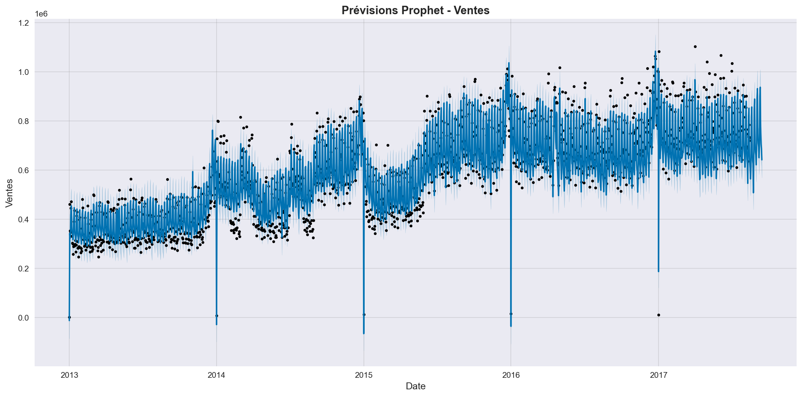

# 📈 Sales Forecasting using SARIMAX and Prophet


---

# 📖 Table of Contents

- Introduction
- Project Objectives
- Dataset
- Technologies Used
- Project Structure
- Data Preprocessing
- Exploratory Data Analysis (EDA)
- SARIMAX Model
- Prophet Model
- Model Evaluation
- Results Comparison
- Power BI Dashboard
- Installation
- How to Run
- Future Improvements
- Author

---

# 📌 Introduction

Accurate sales forecasting is essential for inventory management, production planning, and strategic decision-making in retail.

This project develops and compares two state-of-the-art time series forecasting models:

- **SARIMAX (Seasonal AutoRegressive Integrated Moving Average with Exogenous Variables)**
- **Prophet (Meta/Facebook)**

The objective is to predict future sales using historical sales data and several external variables such as promotions, oil prices, holidays, store characteristics, and customer transactions.

---

# 🎯 Project Objectives

The main objectives are:

- Forecast future sales
- Analyze sales behavior
- Study seasonality and trends
- Evaluate the impact of promotions
- Measure the effect of oil prices
- Improve inventory management
- Compare SARIMAX and Prophet models

---

# 📂 Dataset

The project uses the **Store Sales - Time Series Forecasting** dataset.

## train.csv

| Column | Description |
|---------|-------------|
| id | Unique identifier |
| date | Sales date |
| store_nbr | Store ID |
| family | Product family |
| sales | Daily sales |
| onpromotion | Number of products on promotion |

---

## stores.csv

| Column | Description |
|---------|-------------|
| store_nbr | Store ID |
| city | Store city |
| state | State |
| type | Store type |
| cluster | Store cluster |

---

## oil.csv

| Column | Description |
|---------|-------------|
| date | Date |
| dcoilwtico | Daily oil price |

---

## holidays_events.csv

| Column | Description |
|---------|-------------|
| date | Holiday date |
| type | Holiday type |
| locale | National / Regional / Local |
| locale_name | Region |
| description | Holiday description |
| transferred | Indicates if the holiday was transferred |

---

## transactions.csv

| Column | Description |
|---------|-------------|
| date | Date |
| store_nbr | Store ID |
| transactions | Number of customer transactions |

---

# 🛠 Technologies Used

- Python
- Pandas
- NumPy
- Matplotlib
- Seaborn
- Statsmodels
- Prophet
- Scikit-learn
- Power BI
- Git & GitHub

---

# 📁 Project Structure

```
Sales-Forecasting/

│

├── data/

│ ├── train.csv

│ ├── stores.csv

│ ├── oil.csv

│ ├── holidays_events.csv

│ └── transactions.csv

│

|__Requettes SQL

| |_SQL

| | |__01_detection.sql

| | |__01_nettoyage.sql

| |_SQL1

| | |__11_detection.sql

| | |__11_nettoyage.sql

| |_SQL3

| | |__21_detection.sql

| | |__21_nettoyage.sql

|

├── notebooks/

│

├── src/

│ ├── preprocessing.py

│ ├── eda.py

│ ├── sarimax_model.py

│ ├── prophet_model.py

│ ├── evaluation.py

│ └── visualization.py

│

├── images/

├── README.md

└── requirements.txt

```

---

# ⚙ Data Preprocessing

The preprocessing pipeline includes:

- Loading datasets
- Converting date columns
- Merging datasets
- Handling missing values
- Removing duplicates
- Sorting chronologically
- Creating exogenous variables

Merged datasets:

- train + oil
- train + stores
- train + holidays
- train + transactions

---

# 📊 Exploratory Data Analysis (EDA)

The exploratory analysis includes:

- Sales evolution over time
- Sales distribution
- Promotions analysis
- Oil price evolution
- Transactions analysis
- Correlation matrix
- Seasonal patterns
- Trend analysis

---

# 📈 SARIMAX Model

The SARIMAX model includes the following steps:

### Stationarity Tests

- Augmented Dickey-Fuller (ADF)
- KPSS

### Parameter Selection

- ACF
- PACF

### Seasonal Parameters

```
(p,d,q)

(P,D,Q,s)
```

### Exogenous Variables

- onpromotion
- dcoilwtico
- transactions

### Model Training

The model learns:

- trend
- seasonality
- external variables

---

# 🤖 Prophet Model

The Prophet model was trained using:

### Target

```
sales
```

### Regressors

- onpromotion
- dcoilwtico
- transactions

### Holidays

Official holidays were incorporated using the **holidays_events.csv** dataset.

The model automatically captures:

- trend
- yearly seasonality
- weekly seasonality
- holiday effects

---

# 📉 Model Evaluation

The following metrics were used:

- MAE
- RMSE
- MAPE

---

# 🏆 Results

| Model | MAE | RMSE | MAPE |
|---------|------------:|------------:|-----------:|
| **SARIMAX** | **96,643.11** | **116,647.96** | **12.52%** |
| Prophet | 141,068.17 | 158,923.08 | 18.28% |

---

# 📊 Interpretation

The SARIMAX model achieved the best overall performance.

Compared with Prophet:

- Lower MAE
- Lower RMSE
- Lower MAPE

This indicates that SARIMAX provides more accurate sales forecasts for this dataset.

The inclusion of exogenous variables such as promotions, oil prices, and customer transactions significantly improved forecasting performance.

---

# 📷 Results

## SARIMAX Forecast

*(Add your forecast figure here)*

```

  [image/forecasts.png](https://github.com/midounisamar/Pr-vision-des-ventes/blob/main/image/forecasts.png)

  

```

---

## Prophet Forecast

*(Add your Prophet figure here)*

```

<p align="center">

</p>
```

---

## Evaluation Metrics

*(Add the evaluation charts here)*

```
images/evaluation_metrics.png

images/prophet_evaluation_metrics.png
```

---

# 📊 Power BI Dashboard

The project also includes an interactive Power BI dashboard presenting:

- Total Sales
- Sales by Store
- Sales by Product Family
- Monthly Trends
- Promotions
- Oil Price Evolution

---

# 🚀 Installation

```bash
git clone https://github.com/midounisamar/Prevision-des-ventes.git

cd Prevision-des-ventes
```

Install dependencies

```bash
pip install -r requirements.txt
```

---

# ▶️ Run the Project

```bash
python main.py
```

or

```bash
jupyter notebook
```

---

# 💡 Future Improvements

Future work may include:

- XGBoost
- LightGBM
- LSTM
- Temporal Fusion Transformer (TFT)
- Hybrid SARIMAX-LSTM model
- Hyperparameter optimization
- Automated model selection

---

# 👩‍💻 Author

**Midouni Samar**

Master's Student in Actuarial Science, Data Science and Stochastic Control

Faculty of Sciences of Tunis (FST)

National Engineering School of Tunis (ENIT)

Python • SQL • Machine Learning • Deep Learning • Time Series • Power BI

---

⭐ If you found this project useful, don't forget to give it a star on GitHub!
